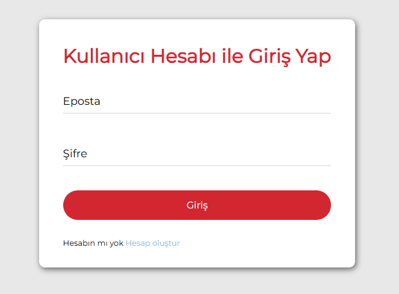
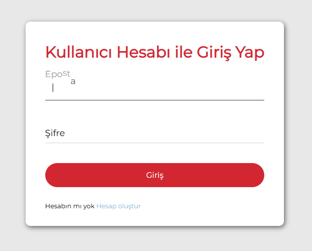

# 🌊 Wave Animation Login Form

A modern and minimal **login panel** with smooth **wave text animation** on input labels.
Built using **HTML**, **CSS**, and **JavaScript**.

---

## ✨ Features

* Clean and responsive design
* Wave animation on input focus
* Email & password login fields

---

## 🎥 Preview

<p align="center">
  
  
  

</p>

---

## 📦 Setup

```bash
# Clone the repository
git clone https://github.com/yourusername/wave-login-form.git
